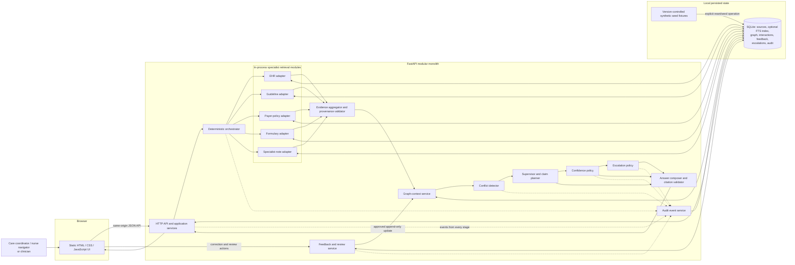

# Synapse — Clinical Knowledge Copilot: Technical Architecture

## 1. Approved Technical Baseline

This document records the approved implementation baseline for the hackathon MVP. It implements the product and conceptual-architecture requirements in `docs/product-spec.md` and `docs/architecture.md`; where those earlier documents intentionally defer implementation choices such as storage, framework, confidence mapping, or reviewer authority, this approved baseline resolves them without changing their safety, provenance, conflict-awareness, escalation, or history-preservation requirements.

Build the hackathon MVP as a **local modular monolith** with one Python application process and one browser client:

- **FastAPI** provides the HTTP API and serves a small framework-free HTML/CSS/JavaScript frontend from the same origin.
- **Plain Python modules** implement orchestration, five source-specific retrieval modules, conflict detection, supervision, confidence, escalation, feedback governance, and audit behavior. “Agent” is a responsibility boundary, not a separate process or an agent framework.
- **SQLite** is the single local persistence layer for synthetic sources, graph-shaped knowledge, questions, answers, feedback, escalations, and append-only audit events.
- **Structured SQLite queries and metadata/tag filters** are authoritative. FTS5 may assist retrieval from narrative guideline and specialist-note excerpts, but every golden scenario has a structured/tagged fallback and does not depend on FTS5 availability.
- **A graph-like relational domain model** represents nodes, assertions, relationships, provenance, status, and supersession. No graph database is needed.
- **Deterministic policy code** owns source requirements, provenance validation, conflict classification, confidence labels, escalation triggers, correction approval, and current-assertion selection.
- **The first working release has no LLM dependency.** Its answer renderer and all authoritative behavior are deterministic. LLM-assisted phrasing may be considered only after every golden scenario passes, and the application must remain fully functional without an API key or network model access.

This design has two local runtime components: **the browser** and **one Python application process**. SQLite is embedded, not a separate service. Any future remote model endpoint is deferred and is not part of the first working release.

The architecture optimizes for a reproducible three-minute demonstration, inspectability, and small failure domains. It deliberately does not introduce microservices, background workers, message queues, a Docker requirement, a vector database, a graph database, or a general-purpose agent framework.

### Architecture acceptance criteria

The implementation produced from this design must be able to demonstrate, using only visibly synthetic fixtures:

1. The canonical prior-authorization question retrieves evidence from the mock EHR, guideline, payer-policy, formulary, and specialist-note sources.
2. Every evidence item carries `source_id`, `source_type`, `source_title`, `version`, `timestamp`, and `relevant_excerpt` from retrieval through the final citation.
3. Clinical support and payer authorization constraints are displayed as separate decision dimensions, with neither silently overriding the other.
4. Missing required information, an unavailable critical source, `LOW` confidence, or an unresolved high-severity conflict produces explicit insufficiency or escalation behavior without invented facts.
5. Every material answer claim cites retrieved evidence; an uncited or unknown citation is rejected before display.
6. A `CARE_COORDINATOR` correction remains pending until a distinct `KNOWLEDGE_REVIEWER` decision. Approval and application atomically append a new assertion and preserve the supplied evidence, prior assertion, original answer, feedback, and audit history.
7. A subsequent query uses the newly approved current payer-policy assertion.
8. The seeded initial state can be restored locally and produces stable expected outcomes.
9. All authoritative results and rendered answers work without an LLM, API key, network model access, or FTS5.
10. The five source adapters execute sequentially in the fixed order EHR, Guideline, Payer Policy, Formulary, Specialist Notes.
11. Reopening an interaction returns its immutable evidence and answer snapshots; a new interaction uses the governed current view as of its question time.
12. Correction approval and application are atomic: success records `APPROVED` and `APPLIED` together, while failure leaves the correction `PENDING` and appends a failed-attempt audit event.

## 2. System Architecture

### Architectural style

The application is divided into modules with explicit Python interfaces, but all backend modules run in one process and share one transactional persistence boundary. This gives the team replaceable components without the network, deployment, tracing, and consistency costs of distributed services.

The architecture has four logical layers:

1. **Presentation:** browser UI and HTTP request/response models.
2. **Application:** use-case services for asking a question, reviewing evidence, submitting feedback, approving or rejecting a correction, and resetting the demo.
3. **Domain:** evidence, assertions, conflicts, confidence, escalation, governance, and audit policies.
4. **Infrastructure:** SQLite repositories, optional FTS retrieval, mock source adapters, and clock/ID providers. A future optional LLM phrasing adapter is deferred.

Dependencies point inward: infrastructure implements domain-facing interfaces, while domain rules do not import FastAPI, SQLite, or an LLM SDK.

### Request execution model

For the small seeded corpus, a question request is synchronous. The orchestrator invokes all five in-process source adapters sequentially in this deterministic order: EHR, Guideline, Payer Policy, Formulary, Specialist Notes. Retrieval concurrency is not permitted in the MVP. No background worker or queue is required.

The answer path has two phases:

1. **Authoritative structured result:** deterministic modules produce the retrieval plan, evidence, graph context, conflicts, confidence, escalation decision, claim candidates, and citations.
2. **Presentation text:** the deterministic renderer phrases only the structured result. A validator prevents new evidence, unknown citations, unsupported claims, or omission of required conflicts and limitations. LLM-assisted phrasing is deferred until all golden scenarios pass and can never replace the deterministic path.

### Component diagram



The arrows to audit represent application-level event recording, not an asynchronous event bus. Audit writes occur through the same SQLite transaction where atomicity matters, especially during feedback approval and graph update.

## 3. Component Catalog

### Responsibilities, choices, and boundaries

| Component | Responsibility | Technology choice and reason | Interface/API boundary | MVP reality |
|---|---|---|---|---|
| Browser frontend | Capture question and synthetic case; display answer, evidence, conflicts, confidence rationale, limitations, escalation, audit, and feedback/review controls | Static semantic HTML, CSS, and small vanilla JavaScript modules served by FastAPI. This avoids a Node build chain and a second server while remaining fully customizable | Uses only versioned same-origin JSON endpoints; never reads SQLite or changes graph state directly | UI behavior is real; identity, production accessibility certification, and clinical-desktop integration are mocked/deferred |
| Backend/API | Validate transport input, authorize supported demo actions, invoke application use cases, and serialize stable responses | FastAPI with Pydantic request/response models. It gives explicit contracts and generated API documentation with limited setup | HTTP boundary; translates transport DTOs to domain commands and domain results back to response DTOs | Real local API; production auth, rate limiting, and deployment controls are deferred |
| Orchestrator | Classify one of the supported intents, build and record a source plan, call all five adapters sequentially in the approved order, and gather successes and failures | Plain Python application service with deterministic intent and routing tables. Easy to inspect and test | `plan(question_context) -> RetrievalPlan`; `execute(plan) -> list[RetrievalResult]` | Real bounded coordination for `PRIOR_AUTHORIZATION`, `CLINICAL_GUIDANCE`, and `SPECIALIST_HISTORY`; unsupported questions return an explicit unsupported-scope result |
| EHR retrieval module | Retrieve explicit synthetic patient and plan facts without inferring missing values | Python adapter over typed SQLite repository queries | `retrieve(EhrQuery) -> RetrievalResult` | Retrieval/normalization is real; EHR system and records are mocked synthetic data |
| Guideline retrieval module | Retrieve applicable synthetic guideline recommendations and effective versions | Python adapter using structured applicability tags, with optional FTS5 over curated excerpts and a tagged fallback | `retrieve(GuidelineQuery) -> RetrievalResult` | Search is real; guideline repository and content are mocked synthetic data |
| Payer-policy retrieval module | Retrieve plan-specific prior-authorization, step-therapy, and documentation rules, including current-version status | Python adapter using exact plan/medication/indication/as-of filters | `retrieve(PayerPolicyQuery) -> RetrievalResult` | Matching is real; payer service and policies are mocked synthetic data |
| Formulary retrieval module | Retrieve synthetic tier, restriction, preferred alternative, and formulary status | Python adapter using exact structured lookup | `retrieve(FormularyQuery) -> RetrievalResult` | Lookup is real; formulary system and data are mocked synthetic data |
| Specialist-note retrieval module | Retrieve dated relevant excerpts from synthetic notes | Python adapter using patient/specialty/date tags, with optional FTS5 and a tagged fallback | `retrieve(NoteQuery) -> RetrievalResult` | Retrieval is real; note repository and content are mocked synthetic data |
| Evidence aggregator | Normalize ordering, validate mandatory provenance, record source failure/staleness, and reject malformed evidence | Deterministic Python domain service | `aggregate(plan, results) -> EvidenceBundle` | Fully real; it never repairs missing provenance by invention |
| Retrieval/storage | Persist all approved data categories and provide structured/FTS query operations | One SQLite database file, accessed through narrow repository interfaces. Embedded, transactional, inspectable, and resettable | Repository protocols; SQL stays in infrastructure modules | Fully real local persistence; enterprise storage is deferred |
| Knowledge graph/context | Store and query entities, assertions, relationships, evidence links, current status, and lineage | Relational graph model in SQLite. It shares transactions and avoids graph infrastructure | `get_context(case, concepts, as_of?) -> KnowledgeContext`; approved update commands only for mutation | Graph behavior is real; graph database, terminology service, and enterprise governance are deferred |
| Conflict detector | Classify same-dimension contradictions, temporal/version mismatches, missing prerequisites, and cross-dimension compatible constraints | Deterministic rule catalog and comparison matrix | `detect(context, evidence) -> list[Conflict]` | Flagship rules are real; generalized clinical contradiction reasoning is deferred |
| Supervisor/claim planner | Check relevance, completeness, provenance, conflict visibility, and produce supported structured claims and next steps | Deterministic Python service | `supervise(bundle, context, conflicts) -> SupervisionResult` | Guardrails and claim plan are real; generalized autonomous clinical reasoning is not claimed |
| Confidence evaluator | Emit exactly `HIGH`, `MEDIUM`, or `LOW` plus factor-by-factor rationale | Approved deterministic decision table, not a numeric probability or model judgment | `evaluate(ConfidenceInputs) -> ConfidenceResult` | Fully real; clinical calibration is explicitly absent |
| Human escalation | Create a visible review request for every mandatory trigger | Deterministic policy and persisted escalation record | `evaluate(answer_state) -> EscalationDecision`; repository commands create/status events | In-app queue/state is real; paging, staffing, SLAs, and ticket integrations are mocked |
| Answer composer/citation validator | Render required sections deterministically and verify every material claim has valid evidence references | Deterministic template renderer; any later LLM phrasing adapter remains optional and post-validated | `compose(ValidatedAnswerInput) -> AnswerSnapshot` | Complete cited answer is real without a model or network |
| Feedback/review | Capture correction, evidence, rationale, actor, time, and separate approval/rejection | Deterministic workflow service with `CARE_COORDINATOR` submitter and distinct `KNOWLEDGE_REVIEWER` reviewer roles | `submit_feedback`, `review_feedback`; no direct graph write from the UI | Workflow is real with synthetic actors; production authentication/RBAC is deferred |
| Knowledge update service | Validate a pending correction and atomically approve and append a new assertion linked to evidence, feedback, reviewer, and predecessor | Deterministic domain service plus one SQLite transaction | Accepts a validated pending correction and reviewer decision; repository does not expose delete/overwrite operations | `APPROVED` and `APPLIED` are committed together; a failure leaves `PENDING` and records a failed attempt |
| Audit logging/view | Preserve inspectable ordered events and immutable answer/evidence snapshots | Append-only SQLite event table plus snapshot references | `append(event)` and read-only timeline queries; no update/delete API | MVP audit semantics are real; tamper evidence, legal retention, and compliance claims are deferred |
| Deferred optional LLM adapter | After all golden scenarios pass, optionally improve phrasing without creating facts or deciding policy | Provider-neutral boundary, not part of the first working release | If later implemented, receives only allowed claims/evidence IDs and returns schema-constrained cited sections | The MVP remains fully functional when absent |

### Processing classification and data contracts

| Component | Consumes | Produces | Processing type |
|---|---|---|---|
| Frontend | API DTOs and user actions | Question, case selection, feedback, and review commands | Deterministic presentation |
| API/application services | Validated HTTP DTOs | Domain commands/results and HTTP responses | Deterministic logic |
| Orchestrator | `QuestionContext`, source capability catalog | `RetrievalPlan`, sequentially ordered retrieval results, source errors, or unsupported-scope result | Deterministic for the three supported intents |
| Retrieval modules | Typed source query plus local fixtures | `RetrievalResult` containing evidence or explicit failure | Retrieval plus deterministic normalization |
| Aggregator | Plan and retrieval results | Validated `EvidenceBundle` | Deterministic validation |
| Graph context | Evidence-backed concepts and case/query keys | Relevant nodes, assertions, relationships, lineage | Retrieval and deterministic current/as-of selection |
| Conflict detector | Assertions, evidence, timestamps, versions | Explicit `Conflict` records | Deterministic rules |
| Supervisor | Evidence bundle, graph context, conflicts, question | Supported claims, missing items, required sections, next-step candidates | Deterministic |
| Confidence evaluator | Availability, relevance, agreement/conflict, freshness, completeness | Label and factor rationale | Deterministic rules |
| Escalation | Missing information, confidence, conflict severity/status | Required/not-required decision and persisted review request | Deterministic rules |
| Composer | Supported claims, citations, confidence, escalation, limitations | Immutable `AnswerSnapshot` | Deterministic rendering and validation for the first working release |
| Feedback/review/update | Target answer/assertion, proposed evidence, actors, decision | Feedback/review events and possibly a new linked assertion | Deterministic governed workflow |
| Audit | Events and immutable object references from every use case | Ordered interaction/governance timeline | Deterministic append-only persistence |

### Supported intents and flagship source criticality

The initial classifier supports exactly `PRIOR_AUTHORIZATION`, `CLINICAL_GUIDANCE`, and `SPECIALIST_HISTORY`. A question outside these intents receives an explicit unsupported-scope response; the system does not attempt broad clinical reasoning.

For the flagship `PRIOR_AUTHORIZATION` intent:

| Criticality | Inputs or sources | Required behavior when missing |
|---|---|---|
| Critical | Synthetic patient/case context, medication, payer/plan, and applicable payer policy | Confidence is `LOW`; state what cannot be verified; require human escalation |
| Important but noncritical | Formulary and clinical guideline | Confidence cannot be `HIGH` unless the versioned confidence policy explicitly determines that source is unnecessary for the supported claim; otherwise use `MEDIUM` |
| Optional | Specialist note | Absence alone does not prevent `HIGH` when sufficient authoritative evidence exists |

All five adapters are still attempted for a supported request so their success or failure is visible and auditable. Criticality affects confidence and escalation; it does not suppress retrieval attempts.

## 4. Approved Technology Decisions

### A. Frontend

| Approved choice | Advantages | Costs/risks | Fit |
|---|---|---|---|
| Static HTML/CSS/vanilla JavaScript served by FastAPI | No build chain, one origin, few dependencies, transparent UI behavior, fast startup | More manual DOM/state handling; less component tooling | **Approved** for the fixed demo views |

**Decision:** Use static HTML/CSS/JavaScript. The MVP needs an answer view, evidence drawer, conflict panel, audit timeline, and feedback/review controls—not a general client application. Avoiding Node in the required run path minimizes setup and demo risk while preserving full control of safety messaging and accessibility labels.

### B. Python backend framework

| Approved choice | Advantages | Costs/risks | Fit |
|---|---|---|---|
| FastAPI + Pydantic + Uvicorn | Typed contracts, automatic OpenAPI, clean dependency boundaries, simple local server | Adds a small framework stack; Python 3.13 compatibility must be verified before pinning versions | **Approved** for the API-first modular monolith |

**Decision:** Use FastAPI. Explicit schemas and uniform error handling lower the risk of malformed evidence, feedback, and review requests crossing boundaries. Pin compatible versions only during the later implementation phase after a Python 3.13 smoke check.

### C. Answer rendering and deferred LLM assistance

**Decision:** The first working release uses deterministic templates only and requires no model interface, API key, or network model access. LLM-assisted phrasing is deferred until all golden scenarios pass. If later added, it must remain optional, schema-constrained, citation-bound, and post-validated, and it must never calculate confidence, assign conflict severity, approve corrections, choose current assertions, or invent missing context.

### D. Retrieval

| Approved choice | Advantages | Costs/risks | Fit |
|---|---|---|---|
| Structured SQLite queries and metadata/tag filters, with optional FTS5 for narrative excerpts | Local, deterministic, inspectable, no embedding service, handles the curated corpus | Semantic recall is intentionally bounded; FTS5 availability can vary | **Approved** with a structured/tagged fallback for every golden scenario |

**Decision:** Use exact structured filters first, metadata/tag filters second, and FTS5 only where useful for narrative guideline or specialist-note excerpts. Stable tie-breaking is mandatory. The golden demo must not depend on FTS5. Embeddings and vector search are deferred.

### E. Local persistence

| Approved choice | Advantages | Costs/risks | Fit |
|---|---|---|---|
| SQLite | Embedded, ACID transactions, foreign keys, optional FTS5, inspectable, easy backup/reset, no daemon | Single-node only; append-only semantics are application-enforced in MVP | **Approved** single runtime store |

**Decision:** Use SQLite for runtime persistence and version-controlled fixture files as the canonical seed input. Every connection explicitly enables and verifies foreign-key enforcement. Schema initialization and demo reset are deterministic; reset restores the exact seeded baseline without mutating fixture files. No database is created by this architecture-document task.

### F. Knowledge graph representation

| Approved choice | Advantages | Costs/risks | Fit |
|---|---|---|---|
| Relational graph-shaped tables in SQLite | One transaction boundary, explicit lineage, easy SQL inspection, no new infrastructure | Traversals are written explicitly; no graph query language | **Approved** for the small bounded graph |

**Decision:** Model graph semantics in relational tables: entities, assertions, relationships, assertion-evidence links, supersession links, and statuses. Queries are shallow and known. A dedicated graph database would add operational cost without improving the flagship workflow.

**What this gains:** atomic updates with feedback and audit, one backup/reset mechanism, foreign-key validation, straightforward inspection, and fewer dependencies.

**What this loses:** native graph traversal syntax, built-in graph algorithms, and graph-oriented visualization tooling. Those are not required for the MVP's bounded one- or two-hop context and lineage queries.

### G. Orchestration

| Approved choice | Advantages | Costs/risks | Fit |
|---|---|---|---|
| Plain Python application service with typed adapter interfaces | Deterministic, debuggable, no framework state, simple tests, fixed sequential ordering | Less automatic tracing/visualization | **Approved** |

**Decision:** Use a plain service and explicit stage result objects. Invoke the five adapters sequentially in the approved order; retrieval concurrency and agent frameworks are deferred. Persist stage events so the audit view provides the observability needed for the demo.

### H. Testing

| Approved choice | Advantages | Costs/risks | Fit |
|---|---|---|---|
| pytest with domain tests and FastAPI integration tests | Concise fixtures/parameterization, strong failure output, well suited to golden scenarios | Adds test dependencies such as pytest and an HTTP test client | **Approved** for core validation |

**Decision:** Use pytest for domain and API integration tests. Keep golden assertions on structured JSON, citations, events, graph state, and deterministic rendered sections rather than broad brittle prose snapshots. Run a manual scripted browser rehearsal for the three-minute demo. A browser automation dependency is deferred unless separately approved after the core suite is stable.

## 5. Baseline Boundaries and Tradeoffs

The approved monolith does not prevent later extraction. The source adapters, repositories, deferred LLM boundary, and use-case interfaces are explicit seams. Extraction should happen only after measured scale, security isolation, ownership, or availability requirements justify it.

The main compromise is reduced breadth: routing and conflict rules intentionally cover the approved medication prior-authorization workflow and its failure/governance variants. The UI and API must label this as a synthetic prototype rather than imply general clinical coverage.

## 6. Data Flow

### Question-to-answer flow

1. The browser submits a question, a synthetic `case_id`, and a synthetic actor/role.
2. The API validates the request and creates an immutable interaction plus `question_received` audit event.
3. The orchestrator deterministically classifies `PRIOR_AUTHORIZATION`, `CLINICAL_GUIDANCE`, or `SPECIALIST_HISTORY`. An unrecognized intent returns an explicit unsupported-scope result and does not trigger broad clinical reasoning.
4. For a supported intent, the orchestrator attempts EHR, Guideline, Payer Policy, Formulary, and Specialist Notes sequentially in that order. Each adapter receives only its typed query and returns normalized evidence or an explicit `missing`, `unavailable`, `malformed`, or `not_applicable` result.
5. The aggregator rejects evidence missing mandatory provenance, calculates freshness from explicit policy inputs, and creates a stable evidence bundle. It never fills missing metadata or facts.
6. The graph-context service retrieves current applied assertions relevant to the case, plan, medication, indication, source versions, and question as-of time. Historic/superseded assertions remain queryable but are not presented as current.
7. Conflict detection compares assertions by decision dimension. It distinguishes clinical appropriateness from coverage, authorization, formulary, and workflow constraints.
8. The supervisor creates supported claim candidates, missing-information items, limitations, and next steps. Each material claim carries one or more evidence IDs before prose composition.
9. The confidence policy applies a transparent decision table. The escalation policy independently enforces mandatory triggers.
10. The deterministic composer renders the answer and verifies allowed claims, citations, conflict disclosure, confidence text, escalation text, and absence of unsupported additions. A later optional LLM phrasing path may be added only after all golden scenarios pass and must fall back to this same renderer.
11. The answer, claim-citation map, confidence factors, conflict records, escalation, and evidence snapshot are persisted before the API responds.
12. The UI displays separate sections for the direct answer, clinical evidence, coverage/authorization constraints, conflicts, missing information, confidence rationale, next steps, and citations.

### Correction-to-future-query flow

1. A synthetic actor with role `CARE_COORDINATOR` submits a correction targeting the seeded payer-policy V1 assertion and selects the pre-seeded V2 document version, with rationale. The correction is recorded as `SUBMITTED` and then validated into `PENDING`; current knowledge does not change.
2. A logically distinct synthetic actor with role `KNOWLEDGE_REVIEWER` reviews the `PENDING` correction. Production authentication and RBAC are not part of the MVP.
3. Rejection appends a `REJECTED` review decision and audit event. Current knowledge is unchanged.
4. Approval and application occur in one SQLite transaction. The transaction appends the `APPROVED` review, immutable V2 document/version and evidence references, V2 assertion, V1-to-V2 supersession lineage, knowledge-update record, audit events, and the updated current/effective view; it records the correction as `APPLIED` in that same commit.
5. If validation or application fails, the approval transaction rolls back, the correction remains `PENDING`, and a failed-attempt audit event is appended in a separate safe transaction. The system never exposes an approved-but-not-applied state.
6. A new question after the effective V2 approval selects V2. Reloading the original question returns its immutable V1 evidence, citations, and answer snapshot.

## 7. Key Domain Objects

Object names below are conceptual contracts, not finalized database or Python schemas.

| Object | Essential fields and invariants |
|---|---|
| `QuestionContext` | `question_id`, text, supported intent or unsupported-scope marker, synthetic `case_id`, synthetic actor/role, UTC `recorded_at`, question `as_of`, known inputs, missing inputs. Missing facts remain explicit |
| `RetrievalPlan` | Plan ID, question ID, ordered required/optional source types, typed queries, reason each source is selected, creation time |
| `SourceSystem` | Stable identity for the source category/system, distinct from any document or evidence identity; supplies the compatibility fields `source_id` and `source_type` |
| `SourceDocument` | Stable logical document/record identity and title, separate from version identity |
| `SourceDocumentVersion` | Immutable version identity, document ID, version label, UTC `recorded_at`, `effective_from`, optional `effective_to`, approval/application state, and content checksum |
| `RetrievalResult` | Unique retrieval-result ID, source-system ID/type, status, evidence IDs, error code/message, duration, attempted query, and retrieval time. Failure contains no fabricated evidence |
| `EvidenceItem` | Immutable evidence/excerpt ID and document-version ID plus compatibility fields `source_id`, `source_type`, `source_title`, `version`, `timestamp`, and `relevant_excerpt`; also excerpt section/location ID, UTC `recorded_at`, `effective_from`, optional `effective_to`, retrieval metadata, synthetic marker, and content checksum |
| `Entity` | Stable ID, entity type, synthetic display label, external fixture key where applicable |
| `Assertion` | Distinct assertion ID, subject entity, predicate/decision dimension, normalized scope, object/value, approval/application state, `recorded_at`, `effective_from`, optional `effective_to`, approval provenance, evidence links, optional predecessor |
| `Relationship` | ID, subject, relationship type, object, evidence links, status/effective interval |
| `Conflict` | ID, involved assertion/evidence IDs, type, decision dimension, explanation, severity, resolution state, answer effect. Distinct-compatible constraints are represented explicitly rather than mislabeled as contradictions |
| `SupportedClaim` | Distinct claim ID, structured proposition, section, materiality, supporting evidence IDs, related conflict IDs. A material claim cannot be persisted in an answer without evidence |
| `Citation` | Distinct final-citation ID linking one answer snapshot and supported claim to one immutable evidence item; it never reuses evidence, assertion, or source IDs as its identity |
| `ConfidenceResult` | Exactly one label, factor outcomes for availability/relevance/agreement/freshness/completeness, plain-language rationale, policy version. No probability field |
| `Escalation` | ID, interaction ID, trigger type, reason, requested information/reviewer expertise, status, created/resolved times, resolution actor/event if any |
| `AnswerSnapshot` | Immutable answer ID and rendered sections, claim-citation mapping, evidence snapshot references, conflicts, confidence, escalation, limitations, composer type/model metadata, timestamps |
| `Feedback` | ID, target answer/assertion, type, proposed correction, rationale, evidence IDs, synthetic `CARE_COORDINATOR` author, `SUBMITTED`/`PENDING`/`REJECTED`/`APPLIED` status, UTC `recorded_at` |
| `ReviewDecision` | ID, feedback ID, approve/reject, rationale, synthetic `KNOWLEDGE_REVIEWER`, UTC `recorded_at`; submitter and reviewer roles are logically distinct |
| `KnowledgeUpdate` | ID, approved feedback/review IDs, new assertion, superseded assertion, evidence IDs, transaction status, UTC `recorded_at` |
| `AuditEvent` | Monotonic event ID, event type, UTC occurred/`recorded_at` times, actor, interaction/aggregate IDs, policy/version metadata, immutable JSON payload or snapshot reference |

Use opaque demo identifiers such as `SYN-CASE-001`; labels must visibly say synthetic. Do not use realistic names, member numbers, or identifiers that could be mistaken for real people.

## 8. API Boundaries

All endpoints are under `/api/v1`, use JSON except static assets, and return stable machine-readable error codes plus safe messages. Exact field schemas should be finalized during implementation from the domain objects above.

| Method and path | Purpose | Important behavior |
|---|---|---|
| `GET /demo/cases` | List visibly synthetic seeded cases | Returns display-safe summaries only |
| `POST /questions` | Ask a question and run the synchronous pipeline | Returns the complete structured answer, explicit insufficient-information result, or explicit unsupported-scope result; persists supported-intent answers before response |
| `GET /interactions/{interaction_id}` | Reload an answer snapshot | Returns the original snapshot, not a recomputation using newer knowledge |
| `GET /interactions/{interaction_id}/evidence` | Inspect cited/retrieved evidence | Includes all mandatory provenance and retrieval status |
| `GET /interactions/{interaction_id}/audit` | Show ordered audit history | Read-only; includes later linked feedback and governance events |
| `POST /feedback` | Submit confirmation or proposed correction | Records `SUBMITTED`, validates into `PENDING`, and never changes current knowledge; validation failure remains an audited `SUBMITTED` attempt |
| `GET /feedback/{feedback_id}` | Inspect feedback and review status | Includes provenance and resulting assertion link if approved |
| `POST /feedback/{feedback_id}/reviews` | Explicitly approve or reject | Enforces valid state transition and reviewer policy; approval invokes atomic graph update |
| `GET /escalations` | List in-app demo review items | Filters may include status and interaction |
| `POST /escalations/{escalation_id}/resolution` | Record a synthetic human resolution | Adds events; never rewrites the triggering answer |
| `POST /demo/reset` | Restore the seeded demo state | Development/demo mode only, explicit confirmation token, refuses outside demo configuration |
| `GET /health` | Local liveness/readiness summary | Reports database, foreign-key, fixture, renderer, and optional FTS5 readiness without exposing secrets |

### Internal interfaces

The most important internal boundaries are:

```text
SourceRetriever.retrieve(typed_query) -> RetrievalResult
EvidenceRepository.find(source_type, filters, terms) -> list[EvidenceItem]
KnowledgeRepository.context(query) -> KnowledgeContext
ConflictPolicy.detect(context) -> list[Conflict]
ConfidencePolicy.evaluate(inputs) -> ConfidenceResult
EscalationPolicy.evaluate(inputs) -> EscalationDecision
AnswerValidator.validate(draft, allowed_input) -> ValidationResult
AuditSink.append(event, transaction?) -> AuditEvent
```

An `AnswerLanguageModel` boundary may be added only after the golden scenarios pass; it is not required by the first implementation milestone.

Adapters must not return raw source-specific objects past the retrieval boundary. The normalized evidence contract is the single provenance-carrying format used downstream.

## 9. Retrieval Design

### Source representation

| Source category | Representation | Primary lookup | Retrieved content |
|---|---|---|---|
| EHR | Structured synthetic case, coverage, condition, medication, prior-therapy, allergy, lab, and encounter facts | Exact `case_id` and requested fact type | Evidence excerpts generated from stored fixture text, never from inferred values |
| Guideline | Versioned synthetic document metadata plus section/excerpt rows and applicability tags | Medication/indication tags and effective date; optional FTS with a tagged fallback | Recommendation, criteria, scope, version, effective time |
| Payer policy | Versioned policy documents and structured rules keyed by synthetic payer/plan, medication, indication, and effective interval | Exact plan + medication + indication + as-of time | PA requirement, step therapy, documentation requirements, policy status |
| Formulary | Versioned structured entries keyed by plan, medication, tier, and effective interval | Exact plan + medication + date | Coverage status, tier, restrictions, preferred alternatives |
| Specialist notes | Versioned synthetic note metadata and excerpt rows with topic tags | Exact case, specialty/date/topic tags; optional FTS with a tagged fallback | Dated relevant statement with note reference and author role |

### Retrieval algorithm

1. Validate exact keys first: synthetic case, plan, medication, indication, and question date.
2. Apply approval/application state, effective interval, question as-of time, and supersession-lineage filters while retaining historic hits for audit and conflict analysis.
3. Use source-specific metadata/tag filters; apply FTS5 only to narrative guideline and specialist-note corpora. If FTS5 is unavailable, use the structured/tagged fallback and produce the same golden-scenario result.
4. Rank exact tagged matches above lexical matches. Break ties by explicit applicability, current status, timestamp, then stable ID.
5. Return a bounded list with the stored excerpt and full mandatory provenance.
6. Return explicit typed failure for no hit, unavailable source, malformed fixture, or stale/unversioned source.

### Provenance propagation

Provenance is copied, not reconstructed:

```text
persisted source row
  -> EvidenceItem with immutable evidence_id and six mandatory fields
  -> assertion_evidence link
  -> Conflict.involved_evidence_ids
  -> SupportedClaim.evidence_ids
  -> AnswerSnapshot.claim_citation_map
  -> citation display and audit snapshot
```

The compatibility field `source_id` identifies only the source system/category. It is never reused as a source-document, document-version, evidence, retrieval-result, assertion, supported-claim, or citation ID. `source_title`, `version`, `timestamp`, and `relevant_excerpt` remain present to satisfy the minimum provenance contract, while the distinct IDs above provide unambiguous lineage.

The final validator checks that every cited evidence ID belongs to the same interaction's retrieved evidence snapshot. It also checks that every material claim has at least one evidence ID. If LLM phrasing is added later, it can select only from IDs supplied to it; fabricated IDs or uncited material text invalidate the draft.

### Missing-source handling

An unavailable payer-policy source returns a failure result with attempted query metadata and no substitute content. The answer must say the policy could not be verified, show the remaining guideline/formulary/EHR/note evidence, avoid a conclusion about authorization status, lower confidence according to the approved policy, and create an escalation when a mandatory trigger applies.

## 10. Knowledge Graph Design

### Relational graph model

The graph-shaped domain model and source repository use these logical tables:

- `entities`: patient/case, plan, payer, medication, indication, guideline, policy, formulary item, note, actor;
- `assertions`: subject, predicate/decision dimension, object/value, status, effective interval, created/approved provenance;
- `relationships`: explicit entity-to-entity edges where a value assertion is insufficient;
- `source_systems`, `source_documents`, and `source_document_versions`: distinct source, document, and immutable version identities;
- `evidence_items`: immutable normalized evidence/excerpt snapshots with section/location identity and checksum;
- `retrieval_results`, `supported_claims`, and `citations`: distinct identities linking retrieval, evidence, claims, and final answer display;
- `assertion_evidence`: many-to-many support links;
- `assertion_supersessions`: directed predecessor-to-successor links plus update provenance;
- `conflicts` and `conflict_assertions`: persisted conflict explanation and involved assertions;
- `feedback`, `review_decisions`, and `knowledge_updates`: governance lineage.

“Current” is derived or constrained, not obtained by deleting history. One governed repository/current-view mechanism is used by both source retrieval and knowledge-context selection. For a governed assertion family, the selector uses normalized scope, approval/application state, effective interval, question as-of time, and supersession lineage. It ensures at most one applied current assertion for the same subject, predicate, scope, and effective instant; attempted violations fail atomically and are audited. Pending or rejected corrections never enter this view.

### Read behavior

- A normal question uses the applied current/effective view as of the question time. A future-effective version cannot apply before `effective_from`.
- Once seeded V2 is approved, applied, and effective, the next payer-policy retrieval and knowledge-context selection both return V2 through this same view.
- The audit view uses immutable answer snapshots and can traverse superseded/current lineage.
- Conflict detection may compare current assertions and relevant historical versions when a recency mismatch is material.
- Pending or rejected feedback evidence never appears as current knowledge, though it remains visible in governance history.

### Write behavior

Only the knowledge-update service may create governed assertions from feedback. Within one approval/application transaction it validates the pending correction and reviewer provenance, appends the immutable successor document version, evidence, assertion, review, update, audit, and lineage records, and updates the current/effective view. It never edits prior content or evidence and never rewrites an earlier answer. Failure rolls back the approval/application transaction, leaves the correction `PENDING`, and records the failed attempt separately.

### Temporal semantics

All stored timestamps use UTC ISO-8601. `recorded_at` states when Synapse recorded an object or event; `effective_from` and `effective_to` define the source version or assertion's applicability interval. The minimum-provenance compatibility field `timestamp` stores the source-issued document/version timestamp and does not replace those three temporal fields. Current/as-of selection always combines normalized scope, approval/application state, effective interval, the question's as-of time, and supersession lineage. Recording or approving a future-effective V2 does not make it applicable before its `effective_from` value.

### Interaction history

Every completed interaction persists immutable evidence and answer snapshots. Reopening Question A returns the evidence versions and citations originally shown, even after knowledge changes. A new Question B evaluates the governed current/effective view at its own as-of time. Therefore, if Question A cited V1 and V2 is later approved and effective, Question A still shows V1 while Question B retrieves and cites V2.

## 11. Conflict-Reconciliation Design

### Decision dimensions

Assertions are tagged with a decision dimension so unlike questions are not flattened into a false winner:

- `clinical_appropriateness` — guideline and relevant clinical context;
- `coverage_status` — payer/formulary coverage;
- `authorization_requirement` — prior authorization and documentation;
- `step_therapy_requirement` — prerequisite therapies;
- `formulary_restriction` — tier and preferred-alternative constraints;
- `patient_context` — explicit synthetic chart facts;
- `specialist_recommendation` — dated specialist statement.

### Deterministic conflict classes

A true contradiction is evaluated only when assertions have compatible normalized scope, including plan, medication, indication, effective/as-of time, and decision dimension where applicable. Different conclusions across different decision dimensions are not, by themselves, contradictory.

| Class | Example | Treatment |
|---|---|---|
| `COMPATIBLE_CONSTRAINT` | Guideline supports medication; payer requires PA | Show both prominently and explain different dimensions; do not call either wrong |
| `SAME_DIMENSION_DISAGREEMENT` | Current payer policy says PA required; current formulary says no restriction for the same plan/date | Show both, mark unresolved, apply configured severity, and do not claim a definitive authorization result |
| `TEMPORAL_VERSION_MISMATCH` | Retrieved older policy conflicts with an approved newer version | Use the approved current version for the current answer, preserve and explain lineage where relevant |
| `ELIGIBILITY_OR_APPLICABILITY_MISMATCH` | Guideline applies to an indication absent from explicit patient context | Mark evidence non-applicable or insufficient; do not infer the indication |
| `MISSING_PREREQUISITE` | Policy requires prior-therapy history that the EHR fixture lacks | Identify the missing fact and trigger insufficiency/escalation as required |
| `SOURCE_UNAVAILABLE` | Current payer policy cannot be retrieved | State inability to verify; never infer its contents |

### Reconciliation output

Conflict detection does not choose a winner. It produces a structured record and an answer effect. The supervisor must include all material conflict records in the answer. Current-version selection is allowed only through an explicit governance/effective-date rule; it is not a semantic decision that one source is more clinically authoritative.

The approved MVP severity policy is:

- high severity when same-scope sources disagree on whether authorization or step therapy is required and the disagreement changes the next action;
- high severity when a required fact cannot be established and proceeding could misstate coverage;
- informational/compatible when clinical guidance supports treatment while payer policy imposes an explicit operational constraint.

Clinical support versus payer prior-authorization or step-therapy requirements is a cross-dimension `COMPATIBLE_CONSTRAINT`, not a logical contradiction. Both statements remain visible in the flagship answer.

## 12. Supervisor, Confidence, and Escalation

### Supervisor gates

Before composition, the supervisor verifies:

1. all required source categories have a result;
2. each successful result has complete provenance;
3. evidence is applicable to the explicit synthetic case and plan;
4. current/version selection is explainable;
5. all material conflicts are represented;
6. each proposed material claim has supporting evidence;
7. missing facts and source failures are named;
8. next steps do not claim authorization, coverage approval, diagnosis, or prescribing authority.

Failure of a required gate produces a structured insufficiency or blocks the affected claim. It is never delegated to the LLM to “reason through.”

### Approved confidence decision table

Confidence is categorical and factor-based, not a sum or probability. Store the policy version with each answer.

- **LOW:** any critical flagship item is missing; evidence is insufficient; provenance for a material claim is incomplete; or an unresolved high-severity same-dimension contradiction remains. `LOW` always requires escalation.
- **MEDIUM:** the answer remains supportable, but meaningful supporting evidence is unavailable or another material uncertainty exists. Missing formulary or guideline evidence prevents `HIGH` unless the versioned policy explicitly determines that source is unnecessary for the supported claim.
- **HIGH:** required evidence is available and applicable/current, provenance is sufficient, and there is no unresolved high-severity same-dimension contradiction. A missing specialist note alone does not prevent `HIGH` when sufficient authoritative evidence exists. A clearly explained guideline-versus-payer `COMPATIBLE_CONSTRAINT` also does not prevent `HIGH` because it concerns different decision dimensions.

The rationale lists each factor outcome—availability, relevance, agreement or conflict, freshness, and required-context completeness—in plain language. The label is deterministic and must never be presented as a clinically validated probability.

### Escalation policy

Escalation is a separate deterministic result so prose or confidence rendering cannot suppress it. It is mandatory when:

- required information is missing;
- confidence is `LOW`; or
- a high-severity conflict remains unresolved.

The escalation record identifies the exact trigger, requested information or expertise, and current status. For the MVP, it appears in an in-app review list; no message is sent to a real person or external system.

## 13. Feedback and Governance Flow

### State transitions

```mermaid
stateDiagram-v2
    [*] --> SUBMITTED: CARE_COORDINATOR submits seeded V2 correction
    SUBMITTED --> PENDING: validation succeeds
    SUBMITTED --> SUBMITTED: validation fails; audit attempt
    PENDING --> REJECTED: KNOWLEDGE_REVIEWER rejects
    PENDING --> APPLIED: APPROVED + APPLIED atomically
    PENDING --> PENDING: approval/application fails; audit attempt
    REJECTED --> [*]
    APPLIED --> [*]
```



There is no transition from submission directly to current knowledge and no externally observable `APPROVED`-but-not-`APPLIED` state. `APPROVED` is the review decision committed atomically with the `APPLIED` correction state. Decisions are append-only events; status fields may be materialized for convenient reads but must be derivable from the event history. The submitter and reviewer roles remain logically distinct; this is not production authentication or RBAC.

### Approval transaction

An approval/application operation must atomically:

1. verify the correction is still `PENDING` and the reviewer has the synthetic `KNOWLEDGE_REVIEWER` role;
2. validate the pre-seeded V2 document, evidence, normalized scope, effective interval, and mandatory provenance;
3. append the `APPROVED` review decision;
4. establish the immutable V2 document version and evidence/excerpt records;
5. append the V2 assertion and evidence links;
6. append the V1-to-V2 supersession lineage;
7. append the knowledge-update record and required audit events;
8. update the governed current/effective view without changing old content; and
9. record the correction as `APPLIED`.

If any step fails, no approval or partial knowledge update is committed. The correction remains `PENDING`, and the failed attempt is recorded in a separate safe transaction without pretending the update was approved or applied. Pending and rejected corrections never enter the current view.

## 14. Audit Design

### Event coverage

At minimum, record:

- question received and validated;
- retrieval plan created;
- each source retrieval started/completed/failed;
- evidence bundle validated;
- graph context selected, including policy/version IDs;
- conflicts detected;
- supervisor gates evaluated;
- confidence and escalation evaluated;
- if added after golden completion, optional LLM requested/completed/failed/rejected, with model/config metadata but no secrets;
- answer snapshot persisted;
- feedback submitted;
- review approved/rejected;
- knowledge update applied/failed;
- escalation status changed;
- demo reset performed.

### Append-only semantics

Application repositories expose insert and read operations for audit events, not update/delete. Corrections append events and new records. The MVP should also deny direct mutation through API routes. This is **application-level immutability**, not a claim of tamper-evident or compliance-grade storage; an operator with file-system/database access could still change SQLite.

Each answer stores immutable references or snapshots sufficient to reproduce what the user saw even after current knowledge changes. Audit payloads use object IDs and relevant policy/config versions; avoid duplicating secrets or unnecessary raw text.

### Transaction boundaries

- A completed answer and its claim/citation/confidence/escalation snapshot are committed together.
- Feedback approval, application, document/evidence/assertion append, current-view change, supersession lineage, knowledge update, and their audit records are committed together.
- Any later external LLM work happens outside a database write transaction. Start/completion events bracket it.

## 15. Testing Strategy

### Unit tests

Use table-driven pytest tests for:

- source routing and required-source planning;
- provenance-field validation and malformed evidence rejection;
- each adapter's exact lookup, no-result, stale, unavailable, and malformed cases;
- graph current/as-of selection and supersession lineage;
- every conflict class and decision dimension;
- the approved confidence decision table and flagship source-criticality rules;
- all mandatory escalation triggers;
- citation completeness and unknown citation rejection;
- feedback state transitions and invalid transition rejection;
- audit repository prohibition of application-level mutation.

Inject a fixed clock, deterministic ID provider, and temporary SQLite database. Tests must not depend on wall-clock time, network, a real model, or FTS5 availability. Verify that SQLite foreign-key enforcement is enabled for every test connection.

### Integration tests

Run the API against a fresh temporary database seeded with canonical synthetic fixtures. Cover:

- successful retrieval from all five adapters;
- one unavailable critical payer source while other evidence remains visible;
- missing patient prerequisite;
- malformed/unversioned evidence exclusion;
- agreement, compatible constraint, and same-dimension disagreement;
- transaction rollback during approval/update;
- failed approval/application leaving the correction `PENDING` with a failed-attempt audit event and no approved-but-not-applied state;
- a future-effective V2 remaining noncurrent before `effective_from`;
- answer reload after a graph update returning the original snapshot;
- unsupported questions returning the explicit unsupported-scope response;
- golden retrieval succeeding through structured/tagged fallback when FTS5 is unavailable;
- reset returning the database to the exact initial fixture state.

### Golden questions

Golden tests assert structured facts rather than exact prose:

- selected source categories;
- evidence IDs and all mandatory provenance;
- expected supported claims and citations;
- conflict types and involved sources;
- confidence label/factors;
- escalation presence/reason;
- graph and audit state.

The flagship golden question must show guideline support and payer PA/step-therapy requirements as `COMPATIBLE_CONSTRAINT`, not as one source defeating the other.

### Feedback-to-graph-update test

1. Start from the exact seed baseline in which immutable synthetic payer policy V1 and V2 both exist, but only V1 is current; ask the canonical question and capture answer A and policy assertion V1.
2. Submit the seeded V2 correction as `CARE_COORDINATOR`; assert `SUBMITTED` then `PENDING`, V1 remains current, and a repeated query still uses V1.
3. Reject in one test; assert no graph change and retained rejection history.
4. Approve in another as `KNOWLEDGE_REVIEWER`; assert approval and application commit atomically, V2 becomes current only when effective, V1 content/evidence remains, a supersession link exists, and all governance events are present.
5. Ask again; assert answer B cites V2 while reloading answer A still cites V1.

### Escalation tests

Parameterize missing required context, unavailable payer source, `LOW` confidence, and unresolved high-severity conflict. Each must produce an explicit reason and requested next step. Also test that a compatible clinical-versus-coverage constraint alone does not falsely trigger high-severity escalation.

### Demo rehearsal

Before presenting, run the focused test suite, execute a reset, complete the exact three-minute script in a clean browser session, and verify no external healthcare service, API key, network model call, live identifier, or PHI appears.

## 16. Local Development Architecture

### Required local layout at runtime

The later implementation should use the existing reserved directories while keeping boundaries explicit:

```text
frontend/                 static HTML/CSS/JavaScript assets
backend/                  FastAPI entry point plus application/domain/infrastructure modules
tests/                    unit, integration, golden fixtures, and expected structured results
docs/                     specifications and architecture
```

This document does not create any of those implementation files.

### Local topology

- Start one Python process bound to loopback, for example `127.0.0.1`.
- FastAPI serves both `/api/v1/*` and the frontend, eliminating CORS and a frontend development server.
- SQLite and generated demo state live in a clearly named local data directory ignored by source control.
- Canonical synthetic seed fixtures remain version-controlled and read-only at runtime.
- Demo reset is an explicit development-only operation that recreates only the known demo database from the seed set.
- The first working release contains the complete deterministic renderer and has no required model configuration. If model-assisted phrasing is added after all golden scenarios pass, the UI discloses the composer type without exposing credentials.

### Expected prerequisites

- Windows and a modern browser;
- Python 3.13.7 and a project virtual environment;
- the later-approved pinned Python packages for FastAPI, its ASGI server, validation, and tests;
- SQLite support in the Python standard library, with foreign keys explicitly enabled and FTS5 treated as optional;
- no Node.js requirement for the approved frontend;
- no API key or network model access requirement.

Do not require Docker, a database server, a graph server, a vector store, or external healthcare credentials.

## 17. Hackathon Demo Architecture

### Three-minute path

1. **Baseline question:** select `SYN-CASE-001` and ask the canonical question. Show that all five sources were planned and retrieved.
2. **Reconciliation:** show the guideline's clinical support next to the payer's authorization/step-therapy constraint and the formulary context. Open one or two claim citations to show version, timestamp, excerpt, and source type.
3. **Confidence and action:** show the categorical confidence rationale and the concrete next step without claiming coverage approval.
4. **Correction:** as synthetic `CARE_COORDINATOR`, flag payer policy V1 as outdated, select the pre-seeded synthetic V2, and show that the `PENDING` correction has not changed current knowledge.
5. **Approval and reuse:** as the logically distinct synthetic `KNOWLEDGE_REVIEWER`, approve and apply V2 atomically, rerun the question, and show V2 is current when effective while V1, the original answer, and the complete audit lineage remain available.

The missing-source/escalation scenario should be pre-seeded as a separate one-click case if time permits, rather than changing fixtures live.

### Reliability controls

- Use a preflight page or health response to confirm database readiness, foreign-key enforcement, fixture version, FTS5 capability, deterministic renderer readiness, and expected seed state.
- Reset before the session and preserve a backup reset command outside the visible flow.
- Keep the full answer pipeline synchronous and bounded; no worker must warm up.
- Use deterministic fixture IDs, clock values where appropriate, ordering, conflict rules, and confidence inputs.
- The demonstration uses deterministic rendering and does not require a model call.
- Never depend on an external EHR, payer, guideline, formulary, specialist-note, graph, or vector service.

## 18. Explicitly Deferred Capabilities

The following are outside the MVP and must not be introduced into the first implementation milestone:

- vector database and embeddings;
- graph database;
- agent frameworks;
- microservices or service decomposition;
- retrieval concurrency;
- background workers and message queues;
- arbitrary document upload or payer-policy parsing;
- production authentication and RBAC;
- production FHIR integration;
- production payer integration;
- any mandatory LLM dependency;
- generic clinical question answering; and
- a Docker requirement.

Broader production architecture—including real EHR, payer, formulary, and guideline integrations; terminology normalization; write-back; identity; consent; patient matching; tenancy; security and compliance controls; validated clinical safety; durable job processing; high availability; disaster recovery; formal knowledge stewardship; and support for real PHI—requires separate product, clinical, security, privacy, legal, and operational approval. The MVP is not HIPAA compliant, clinically validated, production ready, or suitable for unsupervised decision-making.

The MVP architecture is a learning and demonstration vehicle. Its modular boundaries are migration seams, not evidence that deferred production controls or capabilities exist.

## 19. Implementation Baseline and Remaining Blockers

### Approved stack

| Area | Approved baseline |
|---|---|
| Frontend | Semantic HTML, CSS, vanilla JavaScript, served by FastAPI |
| Backend/API | One Python/FastAPI modular-monolith process |
| Domain/orchestration | Plain typed Python modules; sequential adapters; no agent framework |
| Retrieval | Authoritative structured/exact and metadata/tag lookup; optional FTS5 only for narrative guideline/note excerpts; no golden dependency on FTS5 |
| Persistence | One embedded SQLite database with foreign keys enabled and deterministic schema/reset |
| Knowledge graph | Relational graph-shaped tables and one governed current-view mechanism in SQLite |
| Conflict/confidence/escalation | Versioned deterministic policies using the approved rules in this document |
| Answer rendering | Deterministic and fully functional without an LLM, API key, or network model access |
| Testing | pytest domain and API integration suite, structured golden cases, and manual browser rehearsal |

### Runtime component count

**Two local runtime components:** one browser client and one Python/FastAPI process. SQLite is embedded in the Python process. No other service, worker, queue, model endpoint, database server, or container is required.

### Major implementation risks

1. **Fixture quality:** the demonstration will fail conceptually if synthetic sources do not cleanly encode normalized scope, effective dates, provenance, the intended compatible constraint, and a meaningful V1-to-V2 correction.
2. **Citation integrity:** claims must be structured and linked to evidence before deterministic rendering; unsupported material text must be rejected.
3. **Current-versus-historic selection:** a weak assertion-family key or broken transaction could make both policy versions appear current, apply V2 too early, or lose lineage.
4. **Database invariants:** foreign-key enforcement is connection-specific in SQLite and must be enabled and verified everywhere.
5. **Fallback drift:** structured/tagged retrieval must stay behaviorally aligned with optional FTS5 for every golden case.
6. **Overbuilding:** adding any deferred framework, store, integration, upload path, or generic reasoning capability before the golden scenarios pass increases risk without advancing the approved demo.

### Genuinely unresolved decisions blocking the first implementation milestone

The architecture has no unresolved technology or safety-policy decision that blocks beginning the first implementation milestone. The approved baseline resolves runtime topology, storage, retrieval order and fallback, source criticality, confidence, conflict scope, reviewer roles, correction atomicity, history, temporal semantics, provenance identities, supported intents, and deferred capabilities.

Before a golden scenario can be declared complete, the team still must author and approve the exact visibly synthetic fixture values and expected structured outcomes: the case facts, medication and indication, payer/plan, payer-policy V1 and V2 contents and effective intervals, formulary entry, guideline excerpt, specialist-note excerpt, and prototype disclaimer text. These are required implementation inputs, but choosing them does not require reopening the technical architecture. Package versions must also be compatibility-checked and pinned during implementation; no package is selected or installed by this documentation update.
